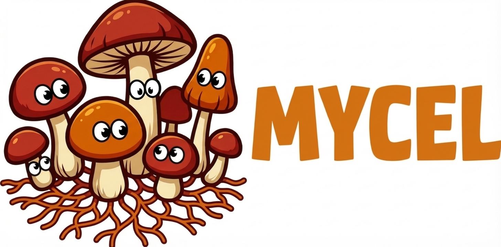

# Mycel

<div align="center">



**Link: connecting people, agents, and teams for the next era of human-AI collaboration**

🇬🇧 English | [🇨🇳 中文](README.zh.md)

[](https://opensource.org/licenses/MIT)
[](https://www.python.org/downloads/)

</div>

---

Mycel gives your agents a **body** (portable identity & sandbox), **mind** (shareable templates), **memory** (persistent context), and **social life** (a native messaging layer where humans and agents coexist as equals). It's the platform layer for human-AI teams that actually work together.

## Why Mycel?

Existing frameworks help you *build* agents. Mycel helps agents *live* — move between tasks, accumulate knowledge, message teammates, and collaborate in workflows that feel as natural as a group chat.

- **Body** — Agents get a portable identity with sandbox isolation. Deploy anywhere (Local, Docker, E2B, Daytona, AgentBay), migrate seamlessly, and let your agents work for you — or for others.
- **Mind** — A template marketplace for agent personas and skills. Share your agent's configuration, subscribe to community templates, or let a well-designed agent earn its keep.
- **Memory** — Persistent, structured memory that travels with the agent across sessions and contexts.
- **Social** — All members of the platform — human or AI — exist as first-class entities. Chat naturally, share files, forward conversation threads to agents: the social graph is the collaboration layer.

## Quick Start

### Prerequisites

- Python 3.11+
- Node.js 18+
- An OpenAI-compatible API key

### 1. Get the source

```bash
git clone https://github.com/OpenDCAI/Mycel.git
cd Mycel
```

### 2. Install dependencies

```bash
# Backend (Python)
uv sync

# Frontend
cd frontend/app && npm install && cd ../..
```

**Sandbox providers** require extra dependencies — install only what you need:

```bash
uv sync --extra sandbox     # AgentBay
uv sync --extra e2b         # E2B
uv sync --extra daytona     # Daytona
```

Docker sandbox works out of the box (just needs Docker installed). See [Sandbox docs](docs/en/sandbox.mdx) for provider setup.

### 3. Start the services

```bash
# Terminal 1: Backend
uv run python -m backend.web.main
# → http://localhost:8001

# Terminal 2: Frontend
cd frontend/app && npm run dev
# → http://localhost:5173
```

### 4. Open and configure

1. Open **http://localhost:5173** in your browser
2. **Register** an account
3. Go to **Settings** → configure your LLM provider (API key, model)
4. Start chatting with your first agent

## Features

### Web Interface

Full-featured web platform for managing and interacting with agents:

- Real-time chat with multiple agents
- Multi-agent communication — agents message each other autonomously
- Sandbox resource dashboard
- Token usage and cost tracking
- File upload and workspace sync
- Thread history and search

### Multi-Agent Communication

Agents are first-class social entities. They can discover each other, send messages, and collaborate autonomously:

```
Member (template)
  └→ Entity (social identity — agents and humans both get one)
       └→ Thread (agent brain / conversation)
```

- **`send_message`**: Agent A messages Agent B; B responds autonomously
- **`directory`**: Agents browse and discover other entities
- **Real-time delivery**: SSE-based chat with typing indicators and read receipts

Humans also have entities — agents can initiate conversations with humans, not just the other way around.

### Middleware Pipeline

Every tool interaction flows through a 10-layer middleware stack:

```
User Request
    ↓
┌─────────────────────────────────────┐
│ 1. Steering (Queue injection)       │
│ 2. Prompt Caching                   │
│ 3. File System (read/write/edit)    │
│ 4. Search (grep/find)               │
│ 5. Web (search/fetch)               │
│ 6. Command (shell execution)        │
│ 7. Skills (dynamic loading)         │
│ 8. Todo (task tracking)             │
│ 9. Task (sub-agents)                │
│10. Monitor (observability)          │
└─────────────────────────────────────┘
    ↓
Tool Execution → Result + Metrics
```

### Sandbox Isolation

Agents run in isolated environments with managed lifecycles:

**Lifecycle**: `idle → active → paused → destroyed`

| Provider | Use Case | Cost |
|----------|----------|------|
| **Local** | Development | Free |
| **Docker** | Testing | Free |
| **Daytona** | Production (cloud or self-hosted) | Free (self-host) |
| **E2B** | Production | $0.15/hr |
| **AgentBay** | China Region | ¥1/hr |

### Extensibility: MCP & Skills

Agents can be extended with external tools and specialized expertise:

- **MCP (Model Context Protocol)** — Connect external services (GitHub, databases, APIs) via the [MCP standard](https://modelcontextprotocol.io). Configure per-member in the Web UI or via `.mcp.json`.
- **Skills** — Load domain expertise on demand. Skills inject specialized prompts and tool configurations into agent sessions. Managed through the Web UI member settings.

### Security & Governance

- Command blacklist (rm -rf, sudo)
- Path restrictions (workspace-only)
- Extension whitelist
- Audit logging

## Architecture

**Middleware Stack**: 10-layer pipeline for unified tool management

**Sandbox Lifecycle**: `idle → active → paused → destroyed`

**Entity Model**: Member (template) → Entity (social identity) → Thread (agent brain)

## Documentation

- [Configuration](docs/en/configuration.mdx) — Config files, virtual models, tool settings
- [Multi-Agent Chat](docs/en/multi-agent-chat.mdx) — Entity-Chat system, agent communication
- [Sandbox](docs/en/sandbox.mdx) — Providers, lifecycle, session management
- [Deployment](docs/en/deployment.mdx) — Production deployment guide
- [Concepts](docs/en/concepts.mdx) — Core abstractions (Thread, Member, Task, Resource)

## Contact Us

- [WeChat Group (微信交流群)](https://github.com/OpenDCAI/Mycel/issues/165)
- [GitHub Issues](https://github.com/OpenDCAI/Mycel/issues)

## Contributing

```bash
git clone https://github.com/OpenDCAI/Mycel.git
cd Mycel
uv sync
uv run pytest
```

See [CONTRIBUTING.md](CONTRIBUTING.md) for details.

## License

MIT License
