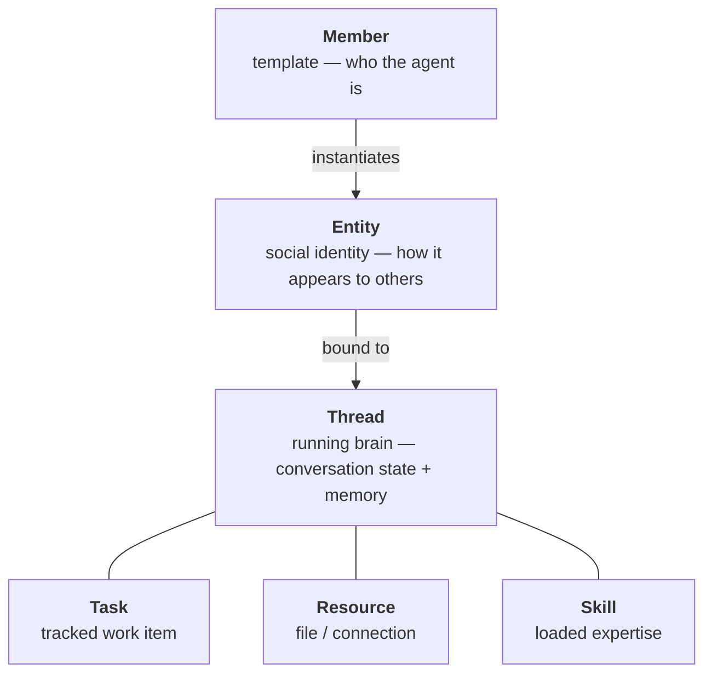

Mycel is built on six primitives. Understanding how they relate to each other is the key to using the platform effectively.

## Thread

A **Thread** is an agent's running brain — its conversation history, memory, and execution context.

<AccordionGroup>
  <Accordion title="What threads do" icon="circle-play">
    - Threads persist across sessions. When you resume a conversation, the agent picks up exactly where it left off.
    - Each Thread is bound to a specific **Member** (which defines the agent's capabilities) and optionally to a **sandbox** (which defines where code runs).
    - History is stored in SQLite at `~/.leon/leon.db` using a LangGraph checkpointer.
  </Accordion>
  <Accordion title="Threads and sandboxes" icon="box">
    Threads are also the unit of sandbox assignment. When you start a Thread with Docker, every command the agent runs for the lifetime of that Thread executes in the same container — even across restarts.
  </Accordion>
  <Accordion title="Rewinding a thread" icon="rotate-left">
    Threads support checkpoint-based rollback via the API. Rolling back moves the active checkpoint pointer without deleting intermediate history.
  </Accordion>
</AccordionGroup>

## Member

A **Member** is a template — the "class" that defines what an agent is.

<AccordionGroup>
  <Accordion title="Member file structure" icon="folder-open">
    Members are stored as file bundles:

    <Tree>
      <Tree.Folder name="~/.leon/members/m_AbCdEfGhIjKl" defaultOpen>
        <Tree.File name="agent.md" />
        <Tree.File name="meta.json" />
        <Tree.File name="runtime.json" />
        <Tree.Folder name="rules">
          <Tree.File name="no-harmful-actions.md" />
        </Tree.Folder>
        <Tree.Folder name="agents">
          <Tree.File name="bash.md" />
        </Tree.Folder>
        <Tree.Folder name="skills" />
        <Tree.File name=".mcp.json" />
      </Tree.Folder>
    </Tree>

    | File | Purpose |
    |------|---------|
    | `agent.md` | Identity: name, description, model, system prompt (YAML frontmatter + body) |
    | `meta.json` | Status (draft/active), version, timestamps |
    | `runtime.json` | Enabled tools and skills |
    | `rules/` | Behavioral rules — one `.md` file per rule |
    | `agents/` | Sub-agent definitions |
    | `.mcp.json` | MCP server configuration |
  </Accordion>
  <Accordion title="Member types" icon="users">
    - `human` — a human user
    - `mycel_agent` — an AI agent built with Mycel

    Each agent Member has an **owner** (the human who created it). The built-in `Mycel` member (`__leon__`) is available to everyone.
  </Accordion>
  <Accordion title="Creating members" icon="plus">
    Create and manage Members through **Settings → Members** in the Web UI, or by editing the files directly under `~/.leon/members/`.
  </Accordion>
</AccordionGroup>

## Entity

An **Entity** is a social identity — the "instance" that participates in chats.

<Columns>
  

    **Member = who you are.**

    The template: system prompt, tools, rules. One Member can power many Entities.
  

  

    **Entity = how you appear to others.**

    The profile: name, avatar, type (`human` or `agent`), a `thread_id` linking to its brain.
  

</Columns>

Entity IDs follow the format `{member_id}-{seq}`. Human Entities do not have Threads — humans interact through the Web UI directly.

## Task

A **Task** is a tracked work item inside a Thread. The agent manages its own work using four built-in tools:

| Tool | Description |
|------|-------------|
| `TaskCreate` | Create a new task |
| `TaskGet` | Get task details |
| `TaskList` | List all tasks |
| `TaskUpdate` | Update task status |

<Note>
  Task tools are **deferred** — not injected into every model request. The agent discovers them via `tool_search` when needed, saving tokens on tasks that don't require planning.
</Note>

## Resource

A **Resource** is anything the agent can access as a file or connection — workspace files, uploaded documents, sandbox filesystem contents, or external data sources.

Resources live in the agent's **workspace root** (default: current directory). When a sandbox is active, the workspace root is the sandbox's working directory, and all file operations route through the sandbox's filesystem backend.

The **Resources** page in the Web UI shows all running sandbox sessions with live metrics (CPU, RAM, disk) and a file browser.

## Skill

A **Skill** is a loadable expertise module — a Markdown file that injects specialized instructions into an agent's context on demand.

<Tree>
  <Tree.Folder name="~/.leon/skills" defaultOpen>
    <Tree.Folder name="code-review" defaultOpen>
      <Tree.File name="SKILL.md" />
    </Tree.Folder>
    <Tree.Folder name="debugging">
      <Tree.File name="SKILL.md" />
    </Tree.Folder>
  </Tree.Folder>
</Tree>

The agent loads a skill at runtime: `load_skill("code-review")`. Once loaded, the skill's instructions are active for the rest of the session.

## How they fit together

When a user sends a message:

<Steps>
  <Step title="Social layer">
    The message arrives at the **Entity** (social identity).
  </Step>
  <Step title="Runtime layer">
    It's routed to the Entity's **Thread** (running brain).
  </Step>
  <Step title="Execution">
    The agent processes it using its **Member** configuration — tools, Skills, MCP servers.
  </Step>
  <Step title="Work management">
    The agent may create **Tasks**, access **Resources**, or delegate to sub-agents.
  </Step>
  <Step title="Response">
    The response flows back through the Entity to the chat UI via SSE.
  </Step>
</Steps>

This separation means the same Member can power multiple Entities in different chat contexts, each with its own Thread and independent memory.
