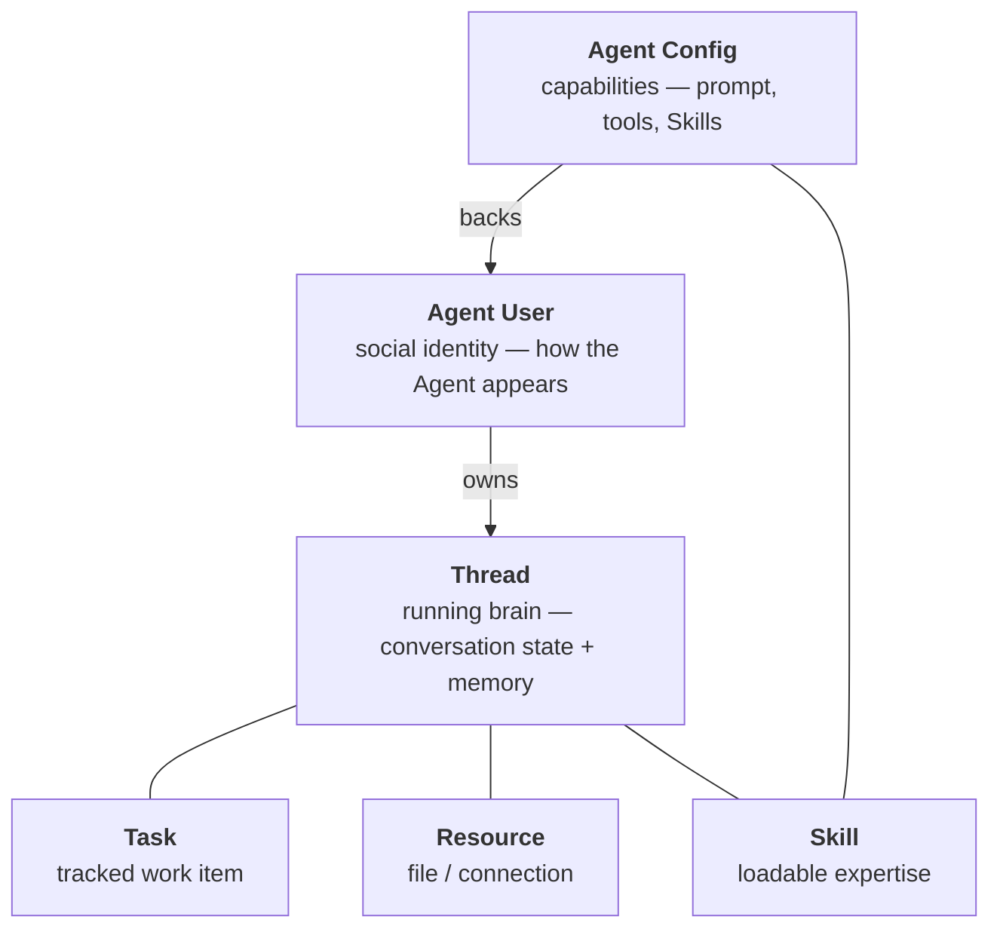

Mycel is built on six primitives. The key split is simple: an **Agent Config** defines capability, an **Agent User** is the social identity, and a **Thread** is the running brain.

## Agent Config

An **Agent Config** is the capability definition for an Agent. It owns the system prompt, enabled tools, rules, assigned Skills, subagents, and advanced MCP integrations.

<AccordionGroup>
  <Accordion title="What an Agent Config contains" icon="sliders">
    | Area | Purpose |
    |------|---------|
    | Prompt | Core system instructions |
    | Tools | Enabled tool groups and tool settings |
    | Rules | Behavioral rules stored as named Markdown documents |
    | Skills | Assigned Skills, loaded on demand with `load_skill` |
    | Subagents | Delegation presets inside this Agent |
    | Advanced MCP | External service integrations kept behind the advanced surface |
  </Accordion>
  <Accordion title="Config and resolved config" icon="check-circle">
    The saved config is the editable source of truth. Runtime startup resolves it into a complete config with Skill content, rule content, tool settings, and integration references ready for the Agent loop.
  </Accordion>
</AccordionGroup>

## Agent User

An **Agent User** is the Agent's social identity. It has a display name, avatar, owner, and a reference to its Agent Config.

Human users and Agent Users participate in the same chat surface. An Agent User can be added from the Marketplace, published back to the Marketplace, or configured locally.

## Thread

A **Thread** is an Agent's running brain: conversation history, memory, execution context, and checkpoint state.

<AccordionGroup>
  <Accordion title="What threads do" icon="circle-play">
    - Threads persist across sessions. When you resume a conversation, the Agent picks up where it left off.
    - Each Agent User has a default Thread, and branch Threads can be created for alternate runs.
    - History is stored with a LangGraph checkpointer.
  </Accordion>
  <Accordion title="Threads and sandboxes" icon="box">
    Threads are also the unit of sandbox assignment. When you start a Thread with Docker, every command the Agent runs for the lifetime of that Thread executes in the same container.
  </Accordion>
  <Accordion title="Rewinding a thread" icon="rotate-left">
    Threads support checkpoint-based rollback via the API. Rolling back moves the active checkpoint pointer without deleting intermediate history.
  </Accordion>
</AccordionGroup>

## Skill

A **Skill** is a loadable expertise module. A Skill contains a `SKILL.md` document plus optional adjacent files such as `references/*`.

<Tree>
  <Tree.Folder name="code-review" defaultOpen>
    <Tree.File name="SKILL.md" />
    <Tree.Folder name="references">
      <Tree.File name="rubric.md" />
    </Tree.Folder>
  </Tree.Folder>
</Tree>

Skills live in Library and can be assigned into an Agent Config. At runtime, the Agent loads a Skill explicitly with `load_skill("code-review")`; the result includes the `SKILL.md` body and adjacent files.

## Task

A **Task** is a tracked work item inside a Thread. The Agent manages its own work using four built-in tools:

| Tool | Description |
|------|-------------|
| `TaskCreate` | Create a new task |
| `TaskGet` | Get task details |
| `TaskList` | List all tasks |
| `TaskUpdate` | Update task status |

<Note>
  Task tools are **deferred**: they are not injected into every model request. The Agent discovers them via `tool_search` when needed.
</Note>

## Resource

A **Resource** is anything the Agent can access as a file or connection: workspace files, uploaded documents, sandbox filesystem contents, or external data sources.

Resources live in the Agent's workspace root. When a sandbox is active, file operations route through the sandbox filesystem backend.

## How they fit together

When a user sends a message:

<Steps>
  <Step title="Social layer">
    The message is addressed to an Agent User in the chat graph.
  </Step>
  <Step title="Runtime layer">
    The Agent User's Thread is selected or created.
  </Step>
  <Step title="Config resolution">
    The Agent Config is resolved into prompt, tools, rules, Skills, subagents, and advanced MCP integrations.
  </Step>
  <Step title="Execution">
    The Agent processes the message, optionally loading Skills or delegating to subagents.
  </Step>
  <Step title="Response">
    The response flows back through the chat UI via SSE.
  </Step>
</Steps>
