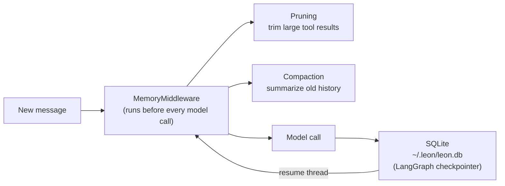

Every Mycel agent has persistent memory built in. Conversation history survives restarts, long sessions are automatically managed to stay within context limits, and no external memory service is required.

## How memory works



Memory in Mycel has two layers:

1. **Persistence** — every message, tool call, and result is stored in SQLite using a LangGraph `AsyncSqliteSaver` checkpointer. Resuming a Thread replays the full history.

2. **Context management** — `MemoryMiddleware` automatically trims and compacts history before every model call, transparently keeping the context window usable.

## Pruning

Pruning trims large tool results to prevent individual outputs from consuming too much context.

<Columns>
  <div>
    **Soft trim** — results longer than `soft_trim_chars` are truncated but kept.

    **Hard clear** — results longer than `hard_clear_threshold` are removed entirely.
  </div>
  <div>
    **Protected recents** — the last `protect_recent` tool messages are never trimmed, so the agent always has its working context.
  </div>
</Columns>

**Default settings:**

| Field | Default | Description |
|-------|---------|-------------|
| `soft_trim_chars` | 3,000 | Trim results longer than this (chars) |
| `hard_clear_threshold` | 10,000 | Clear results longer than this |
| `protect_recent` | 3 | Keep last N tool messages untrimmed |
| `trim_tool_results` | `true` | Enable trimming |

```json
{
  "memory": {
    "pruning": {
      "soft_trim_chars": 5000,
      "hard_clear_threshold": 20000,
      "protect_recent": 5
    }
  }
}
```

## Compaction

Compaction summarizes old conversation history via the LLM when the context window fills. This lets agents work on very long tasks without losing meaningful context.

**Trigger conditions** (both must be met):
- Conversation has at least `min_messages` messages
- Context window is more than 70% full

When triggered, the compaction model summarizes everything except the most recent `keep_recent_tokens` tokens, then replaces the old history with the summary.

**Default settings:**

| Field | Default | Description |
|-------|---------|-------------|
| `reserve_tokens` | 16,384 | Reserve for new messages |
| `keep_recent_tokens` | 20,000 | Keep recent tokens verbatim |
| `min_messages` | 20 | Minimum messages before trigger |

```json
{
  "memory": {
    "compaction": {
      "enabled": true,
      "reserve_tokens": 32768,
      "keep_recent_tokens": 40000,
      "min_messages": 30
    }
  }
}
```

## Spill buffer

For tools that produce very large outputs (e.g., `Grep` on a large codebase), the spill buffer automatically writes the output to a temp file instead of inlining it in the conversation.

```json
{
  "tools": {
    "spill_buffer": {
      "default_threshold": 50000,
      "thresholds": {
        "Grep": 20000,
        "run_command": 100000
      }
    }
  }
}
```

## Storage

| Database | Location | Contents |
|----------|----------|----------|
| Thread history | `~/.leon/leon.db` | Messages, tool calls, results (LangGraph checkpoints) |
| Sandbox state | `~/.leon/sandbox.db` | Session leases, metrics |
| Chat messages | `~/.leon/chat.db` | Entity-Chat social layer messages |

<Note>
  Thread history is append-only. `leonai thread rewind` rolls back to an earlier checkpoint by moving the active pointer — it doesn't delete intermediate history.
</Note>

## Disable compaction or pruning

<Tabs>
  <Tab title="Disable compaction">
    ```json
    {
      "memory": {
        "compaction": { "enabled": false }
      }
    }
    ```
  </Tab>
  <Tab title="Disable pruning">
    ```json
    {
      "memory": {
        "pruning": { "trim_tool_results": false }
      }
    }
    ```
  </Tab>
</Tabs>
