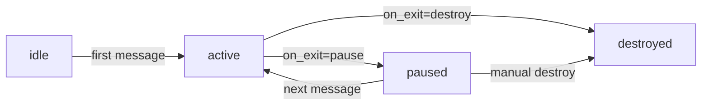
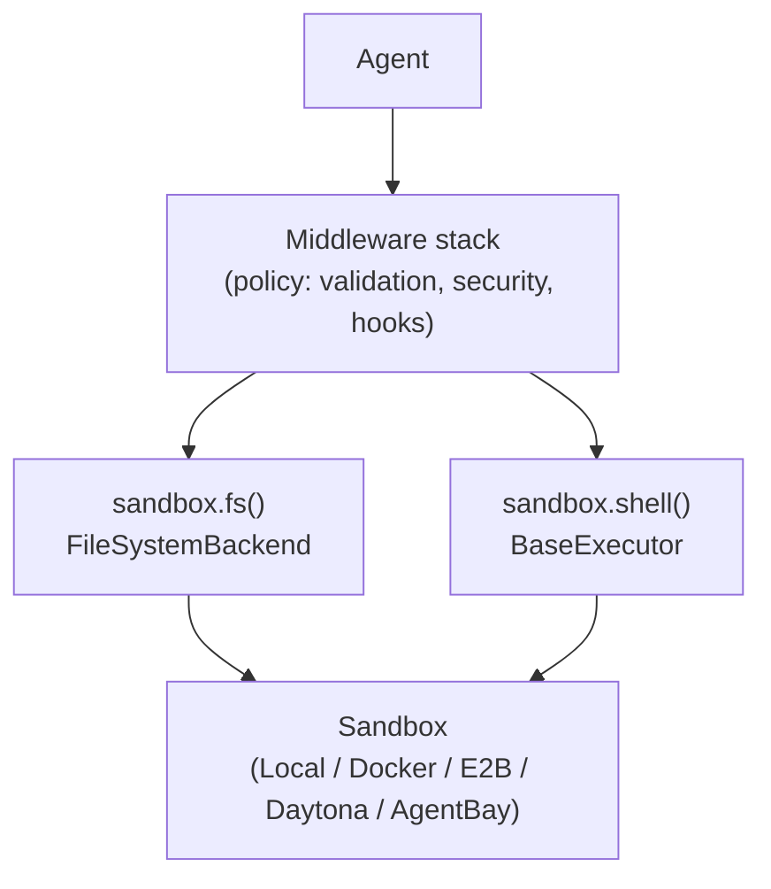

The sandbox system runs agent operations (file I/O, shell commands) in isolated environments instead of the host machine. Every Thread is bound to exactly one sandbox for its lifetime — this is an agent's **body**.

## Provider comparison

| Provider | Isolation | Cost | Best for |
|----------|-----------|------|----------|
| **Local** | None (host passthrough) | Free | Development, trusted code |
| **Docker** | Container | Free | Testing, reproducible environments |
| **Daytona** | Cloud or self-hosted | Free (self-hosted) | Production, team environments |
| **E2B** | Cloud | $0.15/hr | Ephemeral tasks, CI |
| **AgentBay** | Alibaba Cloud | ¥1/hr | China region |

## Session lifecycle



| `on_exit` value | Behavior |
|-----------------|----------|
| `pause` | Pause on exit. Files, packages, processes preserved. |
| `destroy` | Kill on exit. Clean slate next time. |

`pause` is the default — you keep everything across restarts.

## Quick start

<Steps>
  <Step title="Configure a provider">
    Go to **Settings → Sandbox** in the Web UI. Expand the provider card and fill in the required fields:

    | Provider | Required |
    |----------|---------|
    | Docker | Image name, mount path |
    | E2B | API key |
    | Daytona | API key, API URL |
    | AgentBay | API key |

    Config is stored at `~/.leon/sandboxes/<provider>.json`.
  </Step>
  <Step title="Start a sandboxed thread">
    In the new conversation view, use the **sandbox dropdown** in the input area to select your provider. Send your first message — the Thread is now permanently bound to that sandbox.
  </Step>
  <Step title="Monitor resources">
    Go to **Resources** (sidebar). Live CPU/RAM/disk metrics and a file browser per sandbox session.
  </Step>
</Steps>

## Provider configuration

<Tabs>
  <Tab title="Docker">
    Requires Docker on the host. No API key needed.

    ```json
    {
      "provider": "docker",
      "docker": {
        "image": "python:3.12-slim",
        "mount_path": "/workspace"
      },
      "on_exit": "pause"
    }
    ```

    | Field | Default | Description |
    |-------|---------|-------------|
    | `docker.image` | `python:3.12-slim` | Docker image |
    | `docker.mount_path` | `/workspace` | Working directory inside container |
    | `on_exit` | `pause` | `pause` or `destroy` |
  </Tab>
  <Tab title="E2B">
    Cloud sandbox. Requires an [E2B](https://e2b.dev) API key.

    ```json
    {
      "provider": "e2b",
      "e2b": {
        "api_key": "${E2B_API_KEY}",
        "template": "base",
        "cwd": "/home/user",
        "timeout": 300
      },
      "on_exit": "pause"
    }
    ```

    Install: `uv sync --extra e2b`
  </Tab>
  <Tab title="Daytona SaaS">
    ```json
    {
      "provider": "daytona",
      "daytona": {
        "api_key": "${DAYTONA_API_KEY}",
        "api_url": "https://app.daytona.io/api",
        "cwd": "/home/daytona"
      },
      "on_exit": "pause"
    }
    ```

    Install: `uv sync --extra daytona`
  </Tab>
  <Tab title="Daytona self-hosted">
    ```json
    {
      "provider": "daytona",
      "daytona": {
        "api_key": "${DAYTONA_API_KEY}",
        "api_url": "http://localhost:3986/api",
        "target": "us",
        "cwd": "/workspace"
      },
      "on_exit": "pause"
    }
    ```

    <Warning>
      Self-hosted Daytona requires bash at `/usr/bin/bash` in both the runner and workspace images, runner on bridge network, and Daytona Proxy accessible on port 4000.
    </Warning>
  </Tab>
  <Tab title="AgentBay">
    Alibaba Cloud sandbox for the China region.

    ```json
    {
      "provider": "agentbay",
      "agentbay": {
        "api_key": "${AGENTBAY_API_KEY}",
        "region_id": "ap-southeast-1",
        "context_path": "/home/wuying"
      },
      "on_exit": "pause"
    }
    ```

    Install: `uv sync --extra sandbox`
  </Tab>
</Tabs>

## API key resolution

API keys are resolved in order:
1. Config file field (`e2b.api_key`, `daytona.api_key`, etc.)
2. Environment variable (`E2B_API_KEY`, `DAYTONA_API_KEY`, `AGENTBAY_API_KEY`)
3. `~/.leon/config.env`

## Session management

### Web UI

From **Resources**:
- Unified grid of all sessions across all providers
- Click a session card → detail sheet with metrics and file browser
- Pause / Resume / Destroy via UI or API

### API endpoints

| Action | Endpoint |
|--------|----------|
| List sessions | `GET /api/sandbox/sessions` |
| Pause | `POST /api/sandbox/sessions/{id}/pause?provider={type}` |
| Resume | `POST /api/sandbox/sessions/{id}/resume?provider={type}` |
| Destroy | `DELETE /api/sandbox/sessions/{id}?provider={type}` |
| Metrics | `GET /api/sandbox/sessions/{id}/metrics` |

### CLI

```bash
leonai sandbox              # TUI manager
leonai sandbox ls           # List active sessions
leonai sandbox new docker   # Create a Docker session
leonai sandbox pause <id>   # Pause (state preserved)
leonai sandbox resume <id>  # Resume
leonai sandbox rm <id>      # Delete
leonai sandbox metrics <id> # Show CPU/RAM/disk
```

Session IDs can be abbreviated — any unique prefix works.

## Architecture



Middleware owns **policy**. The sandbox backend owns **I/O**. Swapping the backend changes where operations run without touching any middleware logic.

Sessions are tracked in SQLite (`~/.leon/sandbox.db`):

| Table | Purpose |
|-------|---------|
| `sandbox_leases` | Lease lifecycle — provider, desired/observed state |
| `sandbox_instances` | Provider-side session IDs |
| `abstract_terminals` | Virtual terminals bound to Thread + lease |
| `lease_resource_snapshots` | CPU, memory, disk metrics |
