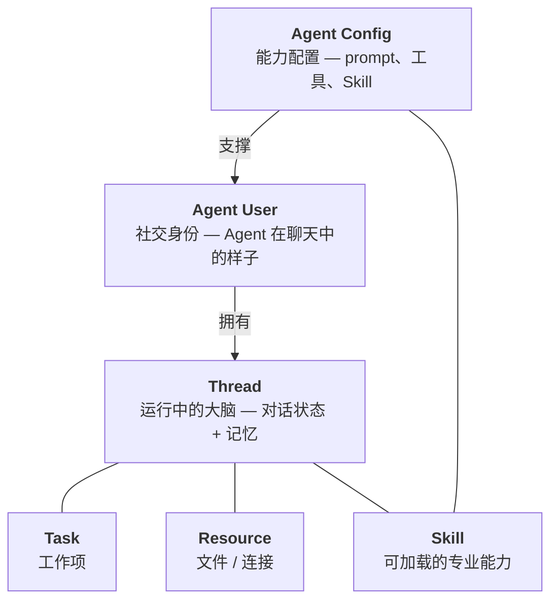

Mycel 建立在六个原语之上。最关键的拆分很简单：**Agent Config** 定义能力，**Agent User** 是社交身份，**Thread** 是运行中的大脑。

## Agent Config

**Agent Config** 是 Agent 的能力定义。它包含 system prompt、启用的工具、规则、分配的 Skill、子 Agent，以及高级 MCP 集成。

<AccordionGroup>
  <Accordion title="Agent Config 包含什么" icon="sliders">
    | 区域 | 用途 |
    |------|------|
    | Prompt | 核心系统指令 |
    | Tools | 启用的工具组和工具设置 |
    | Rules | 以命名 Markdown 文档保存的行为规则 |
    | Skills | 分配给 Agent、运行时通过 `load_skill` 按需加载 |
    | 子 Agent | Agent 内部的派发预设 |
    | 高级 MCP | 外部服务集成，保留在高级入口 |
  </Accordion>
  <Accordion title="config 与 resolved config" icon="check-circle">
    保存下来的 config 是可编辑的事实来源。运行时启动时会解析成完整 config，把 Skill 内容、规则内容、工具设置和集成引用整理好，再交给 Agent loop。
  </Accordion>
</AccordionGroup>

## Agent User

**Agent User** 是 Agent 的社交身份。它有显示名称、头像、所有者，并引用一个 Agent Config。

人类用户和 Agent User 出现在同一个聊天界面里。Agent User 可以从 Marketplace 添加，也可以发布回 Marketplace，或在本地创建和配置。

## Thread

**Thread** 是 Agent 运行中的大脑：对话历史、记忆、执行上下文和 checkpoint 状态。

<AccordionGroup>
  <Accordion title="Thread 的作用" icon="circle-play">
    - Thread 跨会话持久存在。恢复对话时，Agent 会从上次中断的地方继续。
    - 每个 Agent User 有默认 Thread，也可以创建分支 Thread。
    - 历史记录通过 LangGraph checkpointer 存储。
  </Accordion>
  <Accordion title="Thread 与沙箱" icon="box">
    Thread 也是沙箱分配单位。用 Docker 启动一个 Thread 后，该 Thread 生命周期内所有命令都在同一个容器中执行。
  </Accordion>
  <Accordion title="回退 Thread" icon="rotate-left">
    Thread 支持通过 API 基于 checkpoint 回退。回退会移动活跃 checkpoint 指针，不会删除中间历史。
  </Accordion>
</AccordionGroup>

## Skill

**Skill** 是可加载的专业能力模块。一个 Skill 包含 `SKILL.md`，也可以包含 `references/*` 等相邻文件。

<Tree>
  <Tree.Folder name="code-review" defaultOpen>
    <Tree.File name="SKILL.md" />
    <Tree.Folder name="references">
      <Tree.File name="rubric.md" />
    </Tree.Folder>
  </Tree.Folder>
</Tree>

Skill 存在于 Library，并可以分配到 Agent Config。运行时 Agent 显式调用 `load_skill("code-review")`，返回 `SKILL.md` 正文和相邻文件。

## Task

**Task** 是 Thread 内部的被追踪工作项。Agent 使用四个内置工具管理自己的工作：

| 工具 | 说明 |
|------|------|
| `TaskCreate` | 创建任务 |
| `TaskGet` | 获取任务详情 |
| `TaskList` | 列出所有任务 |
| `TaskUpdate` | 更新任务状态 |

<Note>
  Task 工具是 **deferred** 模式：不会注入每次请求。Agent 在需要时通过 `tool_search` 发现。
</Note>

## Resource

**Resource** 是 Agent 可以访问的任何文件或连接：工作区文件、上传的文档、沙箱文件系统或外部数据源。

Resource 存在于 Agent 的工作区根目录。沙箱激活时，文件操作通过沙箱文件系统后端路由。

## 整体运转方式

<Steps>
  <Step title="社交层">
    消息在聊天图谱中发给某个 Agent User。
  </Step>
  <Step title="运行层">
    系统选择或创建这个 Agent User 的 Thread。
  </Step>
  <Step title="配置解析">
    Agent Config 被解析成 prompt、工具、规则、Skill、子 Agent 和高级 MCP 集成。
  </Step>
  <Step title="执行">
    Agent 处理消息，必要时加载 Skill 或派发子 Agent。
  </Step>
  <Step title="回复">
    回复通过 SSE 流回聊天界面。
  </Step>
</Steps>
