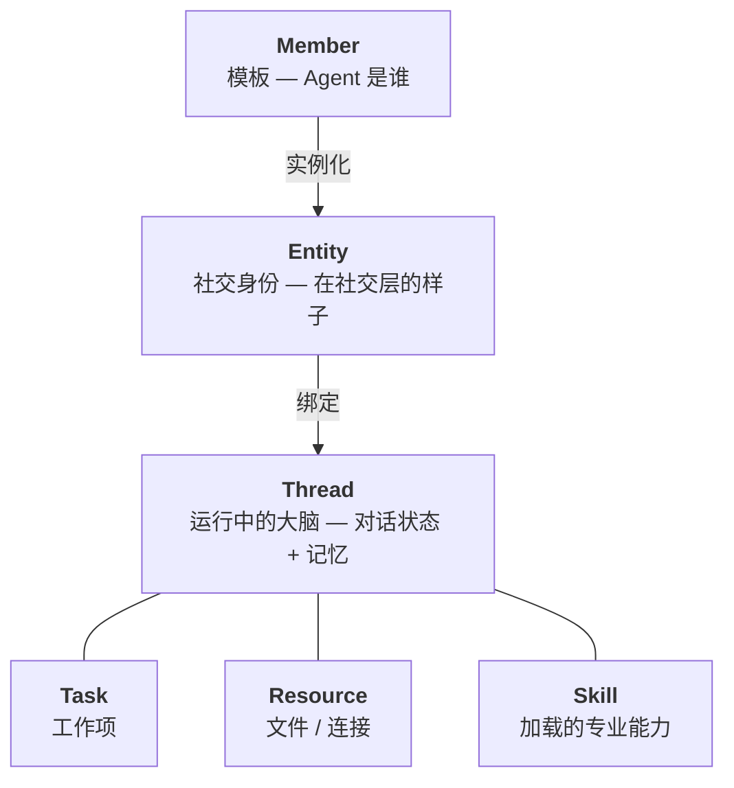

Mycel 建立在六大原语之上。理解它们之间的关系，是高效使用这个平台的关键。

## Thread

**Thread** 是 Agent 运行中的大脑 — 它的对话历史、记忆和执行上下文。

<AccordionGroup>
  <Accordion title="Thread 的作用" icon="circle-play">
    - Thread 跨会话持久存在。恢复对话时，Agent 会从上次中断的地方继续。
    - 每个 Thread 绑定到特定的 **Member**（定义 Agent 能力）和可选的**沙箱**（定义代码运行位置）。
    - 历史记录使用 LangGraph checkpointer 存储在 SQLite（`~/.leon/leon.db`）。
  </Accordion>
  <Accordion title="Thread 与沙箱" icon="box">
    Thread 也是沙箱分配的单位。用 Docker 启动一个 Thread 后，该 Thread 生命周期内所有命令都在同一个容器中执行 — 即使跨重启也是如此。
  </Accordion>
  <Accordion title="回退 Thread" icon="rotate-left">
    Thread 支持通过 API 基于 checkpoint 回退。回退会移动活跃 checkpoint 指针，不会删除中间历史。
  </Accordion>
</AccordionGroup>

## Member

**Member** 是模板 — 定义 Agent "是什么"的"类"。

<AccordionGroup>
  <Accordion title="Member 文件结构" icon="folder-open">
    <Tree>
      <Tree.Folder name="~/.leon/members/m_AbCdEfGhIjKl" defaultOpen>
        <Tree.File name="agent.md" />
        <Tree.File name="meta.json" />
        <Tree.File name="runtime.json" />
        <Tree.Folder name="rules">
          <Tree.File name="行为规则.md" />
        </Tree.Folder>
        <Tree.Folder name="agents">
          <Tree.File name="bash.md" />
        </Tree.Folder>
        <Tree.Folder name="skills" />
        <Tree.File name=".mcp.json" />
      </Tree.Folder>
    </Tree>

    | 文件 | 用途 |
    |------|------|
    | `agent.md` | 身份：名称、描述、模型、系统提示词（YAML frontmatter + 正文） |
    | `meta.json` | 状态（草稿/激活）、版本、时间戳 |
    | `runtime.json` | 启用的工具和 Skills |
    | `rules/` | 行为规则 — 每条规则一个 `.md` 文件 |
    | `agents/` | 子 Agent 定义 |
    | `.mcp.json` | MCP 服务器配置 |
  </Accordion>
  <Accordion title="Member 类型" icon="users">
    - `human` — 人类用户
    - `mycel_agent` — 用 Mycel 构建的 AI Agent

    每个 Agent Member 都有一个**所有者**（创建它的人类）。内置的 `Mycel` member（`__leon__`）对所有人开放。
  </Accordion>
  <Accordion title="创建 Member" icon="plus">
    通过 Web UI 的**设置 → Members** 创建和管理 Member，也可以直接编辑 `~/.leon/members/` 下的文件。
  </Accordion>
</AccordionGroup>

## Entity

**Entity** 是社交身份 — 参与聊天的"实例"。

<Columns>
  

    **Member = 你是谁。**

    模板：系统提示词、工具、规则。一个 Member 可以驱动多个 Entity。
  

  

    **Entity = 你在聊天中的样子。**

    档案：名称、头像、类型（`human` 或 `agent`）、链接到大脑的 `thread_id`。
  

</Columns>

Entity ID 格式为 `{member_id}-{seq}`。人类 Entity 没有 Thread — 人类直接通过 Web UI 交互。

## Task

**Task** 是 Thread 内部的被追踪工作项。Agent 使用四个内置工具管理自己的工作：

| 工具 | 说明 |
|------|------|
| `TaskCreate` | 创建任务 |
| `TaskGet` | 获取任务详情 |
| `TaskList` | 列出所有任务 |
| `TaskUpdate` | 更新任务状态 |

<Note>
  Task 工具是 **deferred** 模式 — 不注入每次请求。Agent 在需要时通过 `tool_search` 发现，节省不需要规划的对话的 token。
</Note>

## Resource

**Resource** 是 Agent 可以访问的任何文件或连接 — 工作区文件、上传的文档、沙箱文件系统或外部数据源。

Resource 存在于 Agent 的**工作区根目录**（默认为当前目录）。沙箱激活时，所有文件操作都通过沙箱的文件系统后端路由。

Web UI 的**资源**页面展示所有运行中的沙箱会话，包含实时指标（CPU、RAM、磁盘）和文件浏览器。

## Skill

**Skill** 是可加载的专业能力模块 — 按需注入专业指令的 Markdown 文件。

<Tree>
  <Tree.Folder name="~/.leon/skills" defaultOpen>
    <Tree.Folder name="code-review" defaultOpen>
      <Tree.File name="SKILL.md" />
    </Tree.Folder>
    <Tree.Folder name="debugging">
      <Tree.File name="SKILL.md" />
    </Tree.Folder>
  </Tree.Folder>
</Tree>

Agent 在运行时加载：`load_skill("code-review")`。加载后，Skill 的指令在当前会话中持续生效。

## 整体运转方式

<Steps>
  <Step title="社交层">
    消息到达 **Entity**（社交身份）。
  </Step>
  <Step title="运行层">
    路由到 Entity 对应的 **Thread**（运行中的大脑）。
  </Step>
  <Step title="执行">
    Agent 根据其 **Member** 配置处理消息 — 工具、Skills、MCP 服务器。
  </Step>
  <Step title="工作管理">
    Agent 可能创建 **Task**、访问 **Resource**，或派发子 Agent。
  </Step>
  <Step title="回复">
    回复通过 Entity 经 SSE 流回聊天界面。
  </Step>
</Steps>

这种分离意味着同一个 Member 可以在不同的聊天上下文中驱动多个 Entity，每个都有自己独立的 Thread 和记忆。
